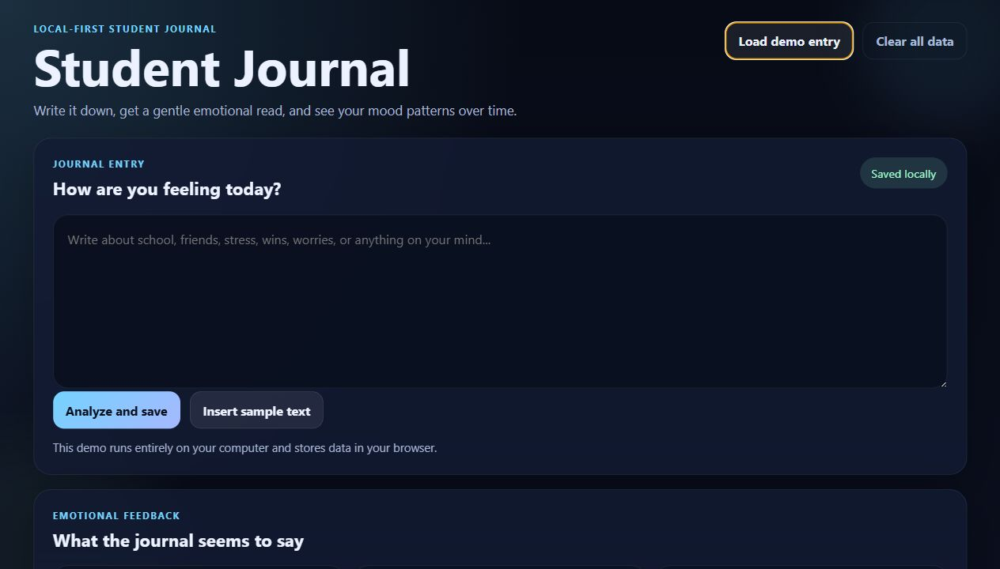

# AI Journal

A fast, local-first student journal demo that reads a journal entry, estimates the emotional tone, and returns gentle feedback plus a simple mood dashboard.

## Preview



## What it does

- Lets the student write a journal entry in the browser
- Scores the text with a lightweight local emotion model
- Returns a mood label, intensity estimate, and supportive advice
- Shows a dashboard with recent entries and recurring themes
- Stores everything locally in `localStorage`

## Tech Stack

- HTML
- CSS
- Vanilla JavaScript
- Node.js local server for `localhost` runs

## Run It Locally

```powershell
npm start
```

Then open:

```text
http://127.0.0.1:3000
```

You can also open `index.html` directly, but the local server is the cleaner option.

## Demo Notes

- The app is fully local and free to run
- No external API is required
- This is a supportive journaling demo, not a medical or clinical tool

## Project Files

- `index.html` - app structure
- `styles.css` - visual design
- `script.js` - analysis, feedback, and dashboard logic
- `server.js` - tiny local server for localhost
